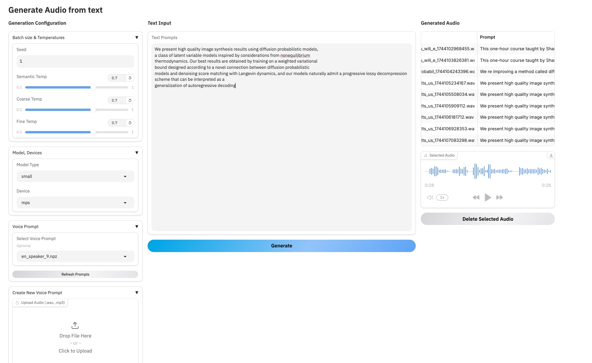

# Generate Audio from text and clone voice with BARK

You can generate audio from text with natural sounding voice and clone any voice (not perfect)


## Features

-   **Text-to-Audio Generation:** Generate speech from text using the BARK model (supports 'small' and 'large' variants).
-   **Parameter Control:** Adjust semantic, coarse, and fine temperature settings for generation diversity. Set a generation seed for reproducibility.
-   **Device Selection:** Run inference on available devices (CPU, CUDA, MPS).
-   **Standard Voice Prompts:** Utilize built-in BARK voice prompts (`.npz` files) located in the `bark_prompts` directory.
-   **Custom Voice Prompt Creation (Voice Cloning):**
    -   Upload your own audio file (.wav, .mp3).
    -   Generate a BARK-compatible semantic prompt (`.npz` file) using a custom-trained HuBERT model.
    -   The generated prompt appears in the "Select Voice Prompt" dropdown for immediate use.
-   **Audio Management:** View, play, and delete generated audio files directly within the interface.
-   **Training Scripts:** Includes scripts to generate the necessary dataset (`generate_audio_semantic_dataset.py`) and train the custom HuBERT model (`train_hubert.py`).

## Custom Voice Cloning Model

The core of the custom voice prompt generation relies on a fine-tuned HuBERT model.

-   **Model:** `sleeper371/hubert-for-bark-semantic` on Hugging Face ([Link](https://huggingface.co/sleeper371/hubert-for-bark-semantic))
-   **Architecture:** This model uses a HuBERT base feature extractor followed by a Transformer decoder head.
-   **Training:** It was trained on over 4700 sentence pairs, mapping audio waveforms to the semantic tokens generated by BARK's semantic model. The training used a cross-entropy loss objective.
-   **Dataset:** The training dataset is available at `sleeper371/bark-wave-semantic` on Hugging Face ([Link](https://huggingface.co/datasets/sleeper371/bark-wave-semantic)).
-   **Comparison:** This approach is inspired by projects like [gitmylo/bark-data-gen](https://github.com/gitmylo/bark-data-gen), but differs in the head architecture (he used an LSTM head while I used a transformers decoder head)

## Setup and Installation

Follow these steps to set up the environment and run the application.

1.  **Clone the Repository:**

2.  **Create a Virtual Environment:**
    It's highly recommended to use a virtual environment to manage dependencies.

    ```bash
    # For Linux/macOS
    python3 -m venv venv
    source venv/bin/activate

    # For Windows
    python -m venv venv
    .\venv\Scripts\activate
    ```

3.  **Install Requirements:**
    Make sure you have a `requirements.txt` file in the repository root containing all necessary packages (e.g., `gradio`, `torch`, `transformers`, `bark-audio`, `soundfile`, etc.).
    ```bash
    pip install -r requirements.txt
    ```

## Running the Application

Once the setup is complete, run the Gradio application:

```bash
python app.py
```

This will launch the Gradio interface, typically accessible at http://127.0.0.1:7860 in your web browser. The console output will provide the exact URL.

## Training Your Own Custom HuBERT Model

If you want to train your own HuBERT model for voice cloning:

1. Generate Dataset:

-   Use the generate_audio_semantic_dataset.py script.

2. Train the Model:

-   Use the train_hubert.py script.

-   This script takes the generated dataset (audio paths and semantic token paths) to fine-tune a HuBERT model with a Transformer decoder head.

-   Configure training parameters (batch size, learning rate, epochs, output directory) within the script or via command-line arguments (if implemented).

## License

MIT

## Acknowledgements

-   Suno AI

-   gitmylo
